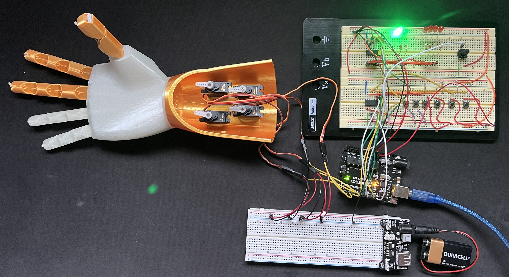
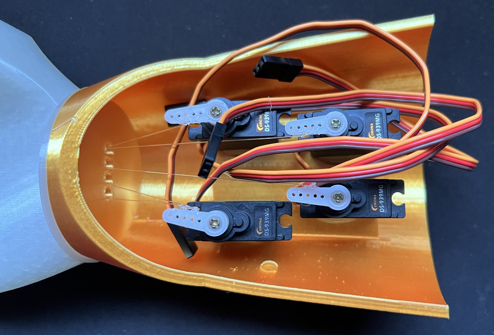

# Prosthetic-Hand-Game

This project consists of the mechanical design, electrical design, software design, and using the system of an articulating hand that plays Rock-Paper-Scissors with the user. The hand also has the built-in functionality to control the fingers individually (the ring and pinky finger move together). This was designed around an interest in robotic prosthetics and exoskeletons. 

## 1. Mechanical Design

The mechanical design was based on a normal human hand. The file was modified from an existing design by grossrc on Thingiverse (https://www.thingiverse.com/thing:1691704). Modifications were done by removing the supports that were originally in the design for the circuits. This allows for the arm portion which holds the 4 servo motors used in this design to have free movement when actuating. The .stl files can be seen in the design folder. The 3D printed hands can be seen below:

The fingers are articulated by 2 things, the fishing line attached to the servo motors, and the nylon string running through the fingers and attached to the hand. The nylon string acts like a tendon that holds the finger in place when not in use. The fishing line is pulled by the servo-motors when they rotate to cause a "muscle" contraction causing the finger(s) to close. The servo motors were positioned to ensure that there would be no collision when the fingers are actuating. The position and the connections of the servo motors can be seen in the image below:

### BOM

|Part|Description|Qty.|
|:---:|:---|:---:|
|Arduino Uno|Main computational system being used.|1|
|3D Printed Hand|Hand that was 3D printed.|1|
|Nylon String|Nylon string used as tendons in the hand.|5|
|10lb. Test Fishing Line|Fishing line used to act like muscles in the hand.|5|
|DS939MG Digital Servo|Servo motors controlling the fingers.|4|
|CD74HC4051E|8 to 1 Multiplexer reading the control buttons.|1|
|SN74AHC595|8-bit Shift Register controlling the LEDs.|1|
|LED|LEDs giving feedback to the user.|6|
|Button|Buttons used to change output seen by the user.|6|
|220Ω Resistor|Resistors used to limit current to LEDs.|6|
|10kΩ Resistor|Pull-down resistors used with the buttons.|6|
|10kΩ Potentiometer|Potentiometer used to control the position of the servos.|1|
|9V Battery|Battery to supply power to the servo motors.|1|
|Wires|Used to connect components.|58|
|Breadboard|Breadboards used for connecting components together.|3|
|MB102 Power Module|Power Supply Module to supply power to the servos from the 9V battery.|1|
|USB Power Cable|Cable to provide power to the Arduino.|1|

## 2. Electrical Design

For the electrical design an Arduino Uno was used as the microcontroller to run the processes for controlling the hand. The Arduino Uno only has 13 I/O digital pins and 6 analog pins. Based on the original design there would be a total of 6 buttons, 6 LEDs, 4 servo-motors, a potentiometer. Based on these components 16 digital pins would have been needed so the multiplexer and the shift register were added which reduces the number of pins needed. Now the number of digital pins is reduced to 12 digital pins with the shift-register being used for the LEDs and the multiplexer being used for the buttons. The system's wiring diagram can be seen below:

The servo motors are connected to their own separate 9V battery to allow for there to be no current drop if all four of the servo motors are active at the same time. This schematic also shows how the multiplexer and the shift-register are wired to help reduce the number of input wires to the Arduino Uno. The multiplexer has 6 buttons each with their own respective function attached that reads LOW. The buttons have 10kΩ pull-down resistors attached to limit current going into the Arduino and when the button is pressed the Arduino will read HIGH. 

## 3. Software Design

The software design for this system is a simplistic streamlined process to allow for reduced memory usage and ease of use. The file main.cpp in the src folder contains the defined functions of the software running on the Arduino. The code uses enumeration to select the specific case for the multiple switch cases determined by the buttons. Within the code the shift register is used to shift binary strings representing the locations of each of the LEDs to light up based on the specific function being performed. The multiplexer is referenced each loop of the Arduino code and checks each LED to see if a button has been pressed. The pressing of a button influences the specific binary string that is then sent to the shift register to change the LEDs that are lit. The button also determines the mode the system is in as well as the specific finger being controlled.

The code consists of 2 modes and 5 functions: Game, Control, setup, loop, gameMove, updateSystem, and shifter. Each function has its respective repetitive functionality. The mode Game allows for the mode button and the random selection of the hand shape button to be pressed. The game button when pressed uses the microcontroller's clock to get a random seed on each loop so that the selection of the hand shape is completely random. In the Control mode the individual fingers are controlled based on a mapping of the potentiometers analog input and the angles of each servo-motor respectively.  Setup sets the needed pins to their respective I/O setting. Loop checks the button to see if one has been pressed as well as when in the control mode allows for the movement of the fingers based on the reading from the potentiometer mapped to the angles of the servo-motors. The gameMove function randomly chooses the shape for the hand to be performed by the hand and also reset the hand if changed from the control mode to the game mode. The updateSystem function handles the different functionalities based on the button that was pressed. Shifter is a function that sends the binary string to the shift register to change the LED output. 

## 4. Using System

Once the system is wired and powered the system will be in the initial state of Game mode. There are two buttons that have functionality while in Game mode, the game button and the mode button. The game button will cause the hand to give a random hand shape from the selection of Rock, Paper, or Scissors. The mode button will switch the mode from Game to Control or Control to Game based on current state. When the mode is changed the LEDs will change color. The green LED represents game mode, the blue LED represents the control mode and the red LEDs represent the finger being controlled. The finger buttons can be pressed while in game mode but will not change the system into a new state unless in the Control mode. When in control mode the finger buttons can be pressed and this will change the finger being used. The potentiometer can then be used to control the position of the servo which controls the fingers position. If the game button is pressed then nothing will happen because the system is in control mode. The buttons and LEDs can be seen labeled in the wiring schematic above and in the system image below:

### 4.1 Limitations

The current system has 2 limitations:
1) It was found that the lifespan on a 9V battery is very short because the servo motors when all in use can draw up to ~1A of current which the 9V battery that has 540mAh can not sustain. To circumvent this issue a 5V power supply at 2A was used and allowed for the use of the system without any current drops.
2) During the contraction of the fingers where they should close the fingers do actuate but they do not fully close as a normal hand would. This is caused by the distance of actuation by the motor not being sufficient to fully pull the finger. This can be fixed by either using a longer motor arm horn or using a different actuator. An actuator that could give a larger actuation distance would be a linear actuator where rotation would not have to be considered. The tension that is on the fishing line also plays an effect. Fishing line has an elastic characteristic that needs to be loaded to allow for the actuation of the motor to be seen by the finger. This could be fixed by introducing a string that has much less elasticity. 
